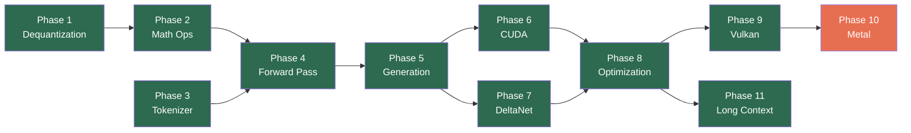

# DAISI has moved to [Daisi Git](https://git.daisi.ai/daisinet/daisi-llogos), a free and fast git management studio that we built from scratch in C#.
## This code base is no longer kept up to date here.
---


# daisi-llogos

**Run AI language models on any device** — your gaming PC, a server, or even a web browser. LLogos is an inference engine that takes a trained AI model file (in [GGUF format](docs/definitions.md#gguf-format)) and runs it to generate text, answer questions, or have conversations.

> **New to AI models?** An "inference engine" is the software that runs a pre-trained AI model. Think of the model file as a recipe and the inference engine as the kitchen — LLogos is the kitchen. See our [Definitions](docs/definitions.md) page for all terminology.

LLogos runs on multiple hardware backends:
- **NVIDIA GPUs** via CUDA (fastest)
- **Any GPU** via Vulkan (AMD, Intel, NVIDIA)
- **Web browsers** via WebGPU (no install needed)
- **CPU** via AVX2/AVX-512 (works everywhere)

All written in C# and TypeScript. No Python, no wrapper libraries — direct hardware access for maximum speed.

**Dependencies**
There are no external, 3rd-party dependencies for the Daisi.LLogos assembly by itself, but you will need to also clone the Daisi.SDK repo so that the IInferenceBackend is accessible for the solutition to build. The Daisi Host uses it. Expected folder structure looks like this:

- /daisinet
  - /daisi-dotnet-sdk
  - /daisi-llogos

In addition to the SDK, you will need to reference one of the LLogos backends in your project: CPU (fallback most of the time), CUDA, or Vulkan. The system will automatically detect if you have CUDA, then look for Vulkan, then go to CPU when the others fail (very slow). 

## Platform Support

| Platform | Backend | Language | Status |
|----------|---------|----------|--------|
| Windows x64 | CPU (AVX2/AVX-512) | C# | Priority |
| Windows x64 | CUDA 13 (NVIDIA) | C# | Priority |
| Windows x64 | Vulkan (NVIDIA/AMD/Intel) | C# | Done |
| **Browser** | **WebGPU (any GPU)** | **TypeScript** | **Done** |
| Linux x64 | CPU (AVX2/AVX-512) | C# | Planned |
| Linux x64 | Vulkan (NVIDIA/AMD/Intel) | C# | Planned |
| macOS arm64 | Metal (Apple Silicon) | C# | Planned |
| macOS x64 | Metal (Intel/AMD) | C# | Planned |
| iOS arm64 | Metal (XCFramework) | C# | Planned |
| Android | WebGPU (Adreno/Mali) | TypeScript | Tested |

## Quick Start

### WebGPU (Browser / Node.js)

```bash
cd src/webgpu
npm install
npm run build
npm test  # 72 tests including GPU inference via Dawn

# Benchmark
npx vitest run test/benchmark.test.ts
```

```typescript
import { LlogosEngine } from '@daisinet/llogos-webgpu';

const engine = new LlogosEngine();
await engine.initGpu();
await engine.loadModel('https://huggingface.co/.../model.gguf');

for await (const token of engine.generate('Hello, world')) {
  process.stdout.write(token);
}
```

### .NET (CPU / CUDA / Vulkan)

```bash
# Build
dotnet build

# Run tests (requires Qwen 3.5 0.8B Q8_0 in C:\GGUFS)
dotnet test

# Generate text (CPU)
dotnet run --project src/Daisi.Llogos.Cli -- \
    --model C:\GGUFS\Qwen3.5-0.8B-Q8_0.gguf \
    --prompt "Hello, world"

# Generate text (CUDA GPU)
dotnet run --project src/Daisi.Llogos.Cli -- \
    --model C:\GGUFS\Qwen3.5-0.8B-Q8_0.gguf \
    --prompt "Hello, world" \
    --backend cuda

# Generate text (Vulkan GPU — NVIDIA/AMD/Intel)
dotnet run --project src/Daisi.Llogos.Cli -- \
    --model C:\GGUFS\Qwen3.5-0.8B-Q8_0.gguf \
    --prompt "Hello, world" \
    --backend vulkan

# Sliding window + attention sinks (fixed memory, infinite streaming)
dotnet run --project src/Daisi.Llogos.Cli -- \
    --model C:\GGUFS\Qwen3.5-0.8B-Q8_0.gguf \
    --prompt "Hello, world" \
    --attention sinks:64,4096

# Benchmark (prefill + decode timing)
dotnet run --project src/Daisi.Llogos.Cli -- \
    --model C:\GGUFS\Qwen3.5-0.8B-Q8_0.gguf \
    --bench --backend cuda

# LoRA training (GPU)
dotnet run --project src/Daisi.Llogos.Cli -- train \
    --model C:\GGUFS\Qwen3.5-0.8B-Q8_0.gguf \
    --data training-data.jsonl \
    --rank 8 --targets qkvofd --backend cuda

# Inference with LoRA adapter
dotnet run --project src/Daisi.Llogos.Cli -- \
    --model C:\GGUFS\Qwen3.5-0.8B-Q8_0.gguf \
    --lora trained-adapter.llra \
    --prompt "What did I train you on?"

# Bonsai 1-bit model (1.1 GB for 8B params, 90 tok/s)
dotnet run --project src/Daisi.Llogos.Cli -- \
    --model C:\GGUFS\Bonsai-8B.gguf \
    --prompt "Hello" --backend cuda
```

### LoRA Training

Train LoRA adapters directly on GGUF models. Supports CPU and CUDA GPU training with ChatML-aware prompt masking.

```bash
# Train a LoRA adapter (CUDA — ~30s per epoch on RTX 5080)
dotnet run --project src/Daisi.Llogos.Cli -- train \
    --model C:\GGUFS\Qwen3.5-9B-Q8_0.gguf \
    --data training_data.jsonl \
    --output adapter.llra \
    --backend cuda \
    --rank 8 --alpha 16 \
    --epochs 3 --lr 1e-4

# Run inference with a trained adapter (merges into weights, zero overhead)
dotnet run --project src/Daisi.Llogos.Cli -- \
    --model C:\GGUFS\Qwen3.5-9B-Q8_0.gguf \
    --lora adapter.llra \
    --prompt "Hello" --backend cuda
```

**Training data formats** (auto-detected from content):
- **Plain text** (`.txt`) — next-token prediction on raw text
- **JSONL** (`.jsonl`) — `{"text": "..."}` with automatic ChatML prompt masking
- **JSONL chat** (`.jsonl`) — `{"prompt": "...", "completion": "..."}` with explicit prompt/completion split

ChatML-formatted text is detected automatically — everything before `<|im_start|>assistant\n` is masked so the model only trains on completions.

**Training options:** `--rank`, `--alpha`, `--targets` (qkvo, qkvof, all), `--lr`, `--epochs`, `--seq-len`, `--warmup`, `--weight-decay`, `--max-grad-norm`, `--grad-accum`, `--seed`, `--save-every`, `--log-every`, `--backend`.

### GBNF Grammar-Constrained Generation

Pure C# GBNF grammar engine — no external parser dependencies. Constrain model output to match any BNF grammar (JSON schemas, tool call formats, structured output).

```bash
dotnet run --project src/Daisi.Llogos.Cli -- \
    --model C:\GGUFS\Qwen3.5-9B-Q8_0.gguf \
    --grammar 'root ::= "{" ws "\"name\"" ws ":" ws string "}"' \
    --prompt "Output a JSON object"
```

Grammar states are pre-resolved to terminals with first-char filtering (~99% candidate reduction). Used by daisi-minion for reliable tool calling.

### Hybrid GPU/CPU Inference

Split model layers between GPU and CPU when the full model doesn't fit in VRAM:

```bash
# First 24 layers on GPU, remaining on CPU
dotnet run --project src/Daisi.Llogos.Cli -- \
    --model C:\GGUFS\Qwen3.5-9B-Q8_0.gguf \
    --backend cuda --hybrid-layers 24 \
    --prompt "Hello"
```

Only 20KB of hidden state transfers between GPU and CPU per layer boundary — VRAM bandwidth (960 GB/s) handles the compute-heavy layers while DDR5 (80 GB/s) handles the rest.

### LLogos Bench (Benchmark Dashboard)

Interactive Next.js dashboard for visual benchmark comparison across models, backends, and KV strategies.

```bash
cd src/bench
npm install
npm run dev   # http://localhost:3000
```

Auto-discovers GGUF models, runs benchmarks via the CLI, and displays prefill/decode tok/s with LLogos Turbo compression stats.

### Test model

Tests validate against [Qwen 3.5 0.8B Q8_0](https://huggingface.co/unsloth/Qwen3.5-0.8B-GGUF). Download the GGUF file to `C:\GGUFS\Qwen3.5-0.8B-Q8_0.gguf`. Tests that require the model skip gracefully if the file is not present.

### Tested models

See [Tested Models](docs/tested-models.md) for verified models, performance benchmarks, supported quantization formats, and recommended downloads.

## Current Status

**End-to-end text generation and LoRA training on CPU, CUDA, and Vulkan.** 251+ passing tests. Supports Q8_0, Q4_0, Q4_1, F16, BF16, F32, Q1_0/Q1_0_g128 (Bonsai 1-bit), I2_S (BitNet), TQ1_0, and K-quant (Q4_K, Q5_K, Q6_K) formats.

### Recent Additions

- **LoRA Training** — Native GPU training with AdamW optimizer. Targets attention, DeltaNet, and FFN projections. See [LoRA Training](docs/lora-training.md).
- **Q1_0/Q1_0_g128** — PrismML Bonsai 1-bit quantization. 8B model in 1.1 GB, 90 tok/s decode on CUDA.
- **BF16 CUDA** — Full BF16 support: embedding lookup, matmul, and dequant kernels.
- **Qwen2/2.5** — Attention bias support for Qwen2 architecture family.
- **Per-model tool prompts** — Tool formatting adapts preamble per model family (Qwen3, Llama3, Gemma, etc.).
- **GBNF Grammar** — Pure C# grammar-constrained generation with pre-resolved states and first-char filtering.
- **DaisiChain** — Layer-wise pipeline parallelism across hosts with 20KB hidden state transfer.
- **Hybrid GPU/CPU** — `--hybrid-layers N` splits model between GPU and CPU.

## Supported Architectures

Each architecture page covers implementation approach, what worked and what didn't, and model-specific benchmarks.

```
  Architecture Family Tree
  ========================

  Transformer
       |
       +-- LLaMA ──────── Standard attention, SwiGLU, RoPE
       |   (llama)         TinyLlama, Llama 3, DeepSeek R1
       |
       +-- Qwen 2/2.5 ─── Standard attention + Q/K/V biases
       |   (qwen2)         Qwen2.5-0.5B, Qwen2.5-7B
       |
       +-- Qwen 3 ──────── Gated Q + Q/K norms + thinking mode
       |   (qwen3)         Qwen3-8B, Bonsai-8B (1-bit)
       |
       +-- Qwen 3.5 ────── Hybrid: DeltaNet + gated attention
       |   (qwen35)        Qwen3.5-0.8B/4B/9B
       |
       +-- Gemma 4 ──────── PLE, GeGLU, NEOX RoPE, sliding-window
       |   (gemma4)         Gemma 4 E4B-it
       |
       +-- BitNet ──────── Ternary weights (I2_S: {-1, 0, +1})
           (bitnet-b1.58)  BitNet b1.58
```

| Architecture | Key Difference | Models | Doc |
|-------------|----------------|--------|-----|
| **LLaMA** | Baseline transformer, GQA, SwiGLU | TinyLlama, Llama 3, DeepSeek R1 | [Details](docs/arch-llama.md) |
| **Qwen 2/2.5** | Attention biases on Q/K/V | Qwen2.5-0.5B | [Details](docs/arch-qwen2.md) |
| **Qwen 3** | Gated Q (DeInterleaveQ), per-head Q/K norms, thinking | Qwen3-8B, Bonsai-8B | [Details](docs/arch-qwen3.md) |
| **Qwen 3.5** | Hybrid DeltaNet + standard attention | Qwen3.5-0.8B/4B/9B | [Details](docs/arch-qwen35.md) |
| **Gemma 4** | Per-Layer Embeddings, GeGLU, NEOX RoPE, sliding-window attention | Gemma 4 E4B-it | [Details](docs/arch-gemma4.md) |
| **BitNet** | Ternary I2_S weights, per-tensor scale | BitNet b1.58 | [Details](docs/arch-bitnet.md) |

### Benchmarks

Measured on AMD Ryzen 9 9900X + NVIDIA RTX 5080, 128 decode tokens, FP16 KV cache. Compared against llama.cpp b8461.

| Model | Llogos CUDA | llama.cpp CUDA | % | Llogos Vulkan |
|-------|--------:|--------:|--------:|--------:|
| Qwen3.5-0.8B Q8_0 | **441** | 399 | **110%** | 156 |
| TinyLlama 1.1B Q8_0 | **448** | 443 | **101%** | — |
| Qwen3.5-4B Q8_0 | **144** | 135 | **107%** | 73 |
| Qwen3-8B Q8_0 | 91 | 92 | 99% | 56 |
| DeepSeek R1 8B Q8_0 | 94 | 95 | 99% | — |
| Qwen3-8B Q4_K_M | **127** | 138 | **92%** | 54 |
| Qwen3.5-9B Q8_0 | **88** | 84 | **105%** | 53 |
| Qwen3.5-9B Q4_0 | 101 | 123 | 82% | 45 |
| Gemma 4 E4B-it Q4_0 | 75 | — | — | — |

**Exceeding llama.cpp** on 4 of 8 models across four architectures (DeltaNet, Gemma 4, LLaMA, standard attention). Q4_K_M gap reduced from 10% to 8% via fused SwiGLU matmul, Q6_K kernel optimization, and cooperative dp4a kernels. See [Inference Optimization White Paper](docs/inference-optimization.md) for technical details.

### WebGPU Benchmarks

Measured via Dawn WebGPU (Node.js), NVIDIA RTX 5090 (Blackwell), 32 decode tokens.

| Model | Prefill | Decode | VRAM |
|-------|---------|--------|------|
| TinyLlama 1.1B Q8_0 | 45 tok/s | — | 1570 MB |
| Llama 3.2 1B Q8_0 | 61 tok/s | 54 tok/s | 2787 MB |
| Qwen 2.5 0.5B Q8_0 | 42 tok/s | 37 tok/s | 1592 MB |
| Qwen 3.5 0.8B Q8_0 | 17 tok/s | 17 tok/s | 1592 MB |

DeltaNet (Qwen 3.5) runs entirely on GPU with zero CPU readbacks — 6 custom WGSL shaders for the state-space computation. See [WebGPU Backend](docs/webgpu-backend.md) for details.

### Key Optimizations

**CUDA:** CUDA graph capture, dp4a integer dot product for 4-bit quants, fused RmsNorm+Q8_1 quantization (zero-overhead dp4a activation prep), **fused MatMulSwiGLU** (single kernel for gate+up projection + SiLU activation in Q4_K FFN layers), cooperative Q4_K dp4a kernel (128 threads, 16 per super-block), partial vocab logit computation (lm_head computes top ~5K tokens instead of full 152K vocab), architecture-adaptive dispatch (Blackwell float vs pre-Blackwell dp4a), per-quant row count tuning, aligned block repacking (Q8_0 34→36, Q4_0 18→20), multi-row activation reuse, cuBLAS F32 GEMV, GPU-side argmax, NVRTC with PTX disk cache.

**Vulkan:** uint32 buffer views, aligned Q8_0 repacking, subgroup arithmetic reduction, multi-row workgroups, fused composite ops (RmsNormResidual, AddRmsNormResidual, AddRmsNorm, SplitSwiGLU, RepeatTile, ArgMax), Q4_0/Q4_1/Q5_K matmul + embedding shaders, Vulkan 1.2 with SPIR-V 1.3.

What works today:
- Parse any GGUF v2/v3 file (header, metadata, tensor info)
- Full quantization type support (41 GgmlType variants with block/type size calculation)
- `IComputeBackend` / `ITensor` abstraction — forward pass is backend-agnostic
- CPU backend: AVX2 SIMD matmul (fused Q8_0 dequant), multi-threaded, full dequantization (Q8_0, Q4_0, Q4_K, Q5_K, Q6_K, Q3_K, Q2_K, Q4_1, Q5_0, Q5_1, BF16, F16, I2_S, TQ1_0)
- CUDA backend: NVRTC JIT compilation with PTX cache, `__dp4a` integer matmul (Q4_0, Q8_0), cuBLAS F32, fused dequant+matmul kernels (F32, F16, Q8_0, Q4_0, Q4_1, Q4_K, Q5_K, Q6_K, I2_S, TQ1_0), fused RmsNorm+Q8_1 quantization, partial vocab argmax, aligned repacking (Q8_0, Q4_0)
- Vulkan backend: SPIR-V compute shaders, fused dequant+matmul (F32, F16, Q8_0, Q4_0, Q4_1, Q4_K, Q5_K, Q6_K, I2_S, TQ1_0), cross-platform GPU (NVIDIA/AMD/Intel)
- 16+ composite GPU operations: GatedAttention, DeltaNetStep, CausalConv1d, ComputeDecayBeta, SplitUnequalQKV, RepeatTile, ArgMax, RmsNormResidual+Q8_1, SwiGLU, AddRmsNorm+Q8_1, etc.
- Complete hybrid forward pass: standard gated attention + DeltaNet (Qwen3.5 0.8B, 4B, and 9B)
- BPE tokenizer, KV cache, DeltaNet recurrent state + conv1d buffers
- Tiled/flash attention with online softmax (no shared memory limit on context length)
- FP16 KV cache (2x memory savings, default)
- [**LLogos Turbo**](docs/llogos-turbo.md): Extreme KV cache compression (8-12x) via Walsh-Hadamard rotation + scalar quantization + QJL correction (`--kv-quant turbo:3`)
- Sliding window + attention sinks for fixed-memory streaming (`--attention sinks:64,4096`)
- Paged KV cache with dynamic allocation (`--paged`), RAM offloading (`--offload-pages`)
- GBNF grammar-constrained generation (pure C#, pre-resolved states, first-char filtering)
- **LoRA training**: rank-decomposed adapters targeting attention (Q/K/V/O) and FFN (gate/up/down), ChatML-aware prompt masking, GPU-accelerated AdamW with cosine warmup, `.llra` binary format
- **DaisiChain**: Layer-wise pipeline parallelism across hosts — split model loading, 20KB hidden state transfer between stages, identical output to single-process inference
- **Hybrid GPU/CPU inference**: `--hybrid-layers N` offloads first N layers to GPU, rest on CPU
- Candidate-based sampler with temperature, top-k, top-p, repetition penalty (O(k) not O(N log N))
- Memory-mapped model loading (zero intermediate byte[] copies)
- Benchmark suite with separate prefill/decode timing (`--bench`)
- CLI: `--backend cpu|cuda|vulkan`, `--bench`, `--no-mmap`, `--attention`, `--paged`, `--offload-pages`, `--hybrid-layers`, `--vocab-limit`, `--lora`, `--grammar`, model path, prompt, sampling parameters

**WebGPU** (TypeScript, browser + Node.js):
- Runs in Chrome 113+, Edge 113+, or Node.js via Dawn bindings
- 20+ WGSL compute shaders: matmul (F32, Q4_0, Q8_0), attention with GQA, RMSNorm, RoPE, SwiGLU, embedding
- 6 DeltaNet-specific GPU shaders: conv1d, L2 norm, decay/beta, state update, SiLU gate
- Supports Llama, Qwen 2/2.5, Qwen 3.5 (DeltaNet hybrid) architectures
- Chat template engine with Llama 3, ChatML, and Jinja2 support
- HTTP model loading with browser Cache API persistence
- DAISI network integration via gRPC-web (Browser Host)
- 72 automated tests including GPU inference via Dawn WebGPU Node bindings

## Roadmap



| Phase | Name | Goal | Status |
|-------|------|------|--------|
| 0 | [GGUF Parser](#current-status) | Parse GGUF files, read metadata and tensor info | Done |
| 1 | [Dequantization](docs/roadmap/phase-01-dequantization.md) | `IComputeBackend` + CPU dequantization (Q8_0, Q4_0, Q4_K) | Done |
| 2 | [Math Ops](docs/roadmap/phase-02-math-ops.md) | CPU SIMD matmul, RMSNorm, softmax, SiLU, RoPE | Done |
| 3 | [Tokenizer](docs/roadmap/phase-03-tokenizer.md) | BPE tokenizer from GGUF metadata | Done |
| 4 | [Forward Pass](docs/roadmap/phase-04-forward-pass.md) | Model loading + hybrid forward pass (attention + DeltaNet) | Done |
| 5 | [Generation](docs/roadmap/phase-05-generation.md) | Sampling, text generation loop, CLI | Done |
| 6 | [CUDA](docs/roadmap/phase-06-cuda.md) | NVIDIA GPU backend with fused kernels | Done |
| 7 | [DeltaNet](docs/roadmap/phase-07-deltanet.md) | Qwen 3.5 hybrid DeltaNet architecture | Done (folded into Phase 4) |
| 8 | [Optimization](docs/roadmap/phase-08-optimization.md) | Mmap loading, benchmark suite, multi-threaded CPU, CUDA tuning | Done |
| 9 | [Vulkan](docs/roadmap/phase-09-vulkan.md) | Cross-platform GPU backend (Windows/Linux) | Done |
| 10 | [Metal](docs/roadmap/phase-10-metal.md) | Apple GPU backend (macOS/iOS) | Not started |
| 11 | [Long Context](docs/roadmap/phase-11-long-context.md) | Flash attention, paged KV, RAM offload — 200K+ context on 16GB | Done (11a-11e) |

## Documentation

| Document | Description |
|----------|-------------|
| [Definitions](docs/definitions.md) | Glossary of all key terms |
| [Architecture](docs/architecture.md) | Solution structure, backend abstraction, data flow |
| [GGUF Format](docs/gguf-format.md) | Binary format deep dive with byte-level layouts |
| [Inference Pipeline](docs/inference-pipeline.md) | Complete walkthrough: tokenize → forward pass → sample |
| [CUDA Backend](docs/cuda-backend.md) | P/Invoke design, kernel compilation, fused operations |
| [DeltaNet](docs/deltanet.md) | Gated DeltaNet linear attention and hybrid architecture |
| [Vulkan Backend](docs/vulkan-backend.md) | P/Invoke design, SPIR-V shaders, cross-platform GPU compute |
| [WebGPU Backend](docs/webgpu-backend.md) | Browser-native GPU inference, WGSL shaders, DeltaNet on GPU |
| [LLogos Turbo](docs/llogos-turbo.md) | Extreme KV cache compression (8-12x) via TurboQuant — architecture, usage, benchmarks, roadmap |
| [Long Context](docs/roadmap/phase-11-long-context.md) | Flash attention, paged KV cache, RAM offloading for 200K+ context |
| [LoRA Training](docs/lora-training.md) | Native GPU LoRA fine-tuning — architecture, DeltaNet support, data formats, performance |
| [Arch: LLaMA](docs/arch-llama.md) | LLaMA family — implementation, benchmarks, what worked |
| [Arch: Qwen 2](docs/arch-qwen2.md) | Qwen 2/2.5 — attention biases, implementation notes |
| [Arch: Qwen 3](docs/arch-qwen3.md) | Qwen 3 — gated Q, Bonsai 1-bit, kernel optimizations |
| [Arch: Qwen 3.5](docs/arch-qwen35.md) | Qwen 3.5 — hybrid DeltaNet, training approach, lessons learned |
| [Arch: Gemma 4](docs/arch-gemma4.md) | Gemma 4 — Per-Layer Embeddings, GeGLU, NEOX RoPE, sliding-window |
| [Arch: BitNet](docs/arch-bitnet.md) | BitNet b1.58 — ternary I2_S, dedicated kernels |
| [Pipelined Inference](docs/pipelined-inference.md) | Run models bigger than your GPU — per-layer weight streaming from shard files |
| [Tested Models](docs/tested-models.md) | Verified models, performance benchmarks, supported quantization formats |
| [Known Issues](docs/known-issues.md) | Investigation notes on K-quant accumulation errors and DeltaNet architecture |

## Solution Structure

```
daisi-llogos/
├── src/
│   ├── dotnet/                      .NET inference engine suite
│   │   ├── Daisi.Llogos/            Core library (GGUF, model, inference, tokenizer, GBNF grammar)
│   │   ├── Daisi.Llogos.Training/   LoRA training (adapters, forward/backward, AdamW optimizer)
│   │   ├── Daisi.Llogos.Cpu/        CPU compute backend (AVX2/AVX-512 SIMD)
│   │   ├── Daisi.Llogos.Cuda/       NVIDIA CUDA backend (dp4a, fused kernels)
│   │   ├── Daisi.Llogos.Vulkan/     Vulkan compute backend (SPIR-V shaders)
│   │   ├── Daisi.Llogos.Cli/        Command-line interface (inference + training)
│   │   ├── tests/                   Unit and integration tests
│   │   └── Daisi.Llogos.sln         Solution file
│   ├── bench/                       LLogos Bench — Next.js benchmark dashboard
│   └── webgpu/                      Browser/Node.js inference engine [TypeScript]
│       ├── src/                     Engine source (GGUF, GPU, model, tokenizer)
│       ├── test/                    72 automated tests (including GPU via Dawn)
│       └── package.json             @daisinet/llogos-webgpu
└── docs/                            Architecture and roadmap documentation
```

## License

MIT License. Copyright 2026 DAISI.
